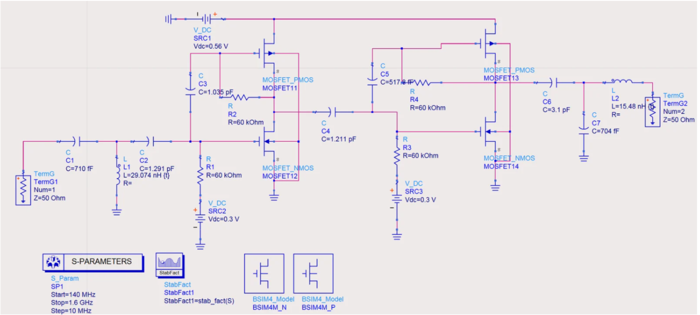
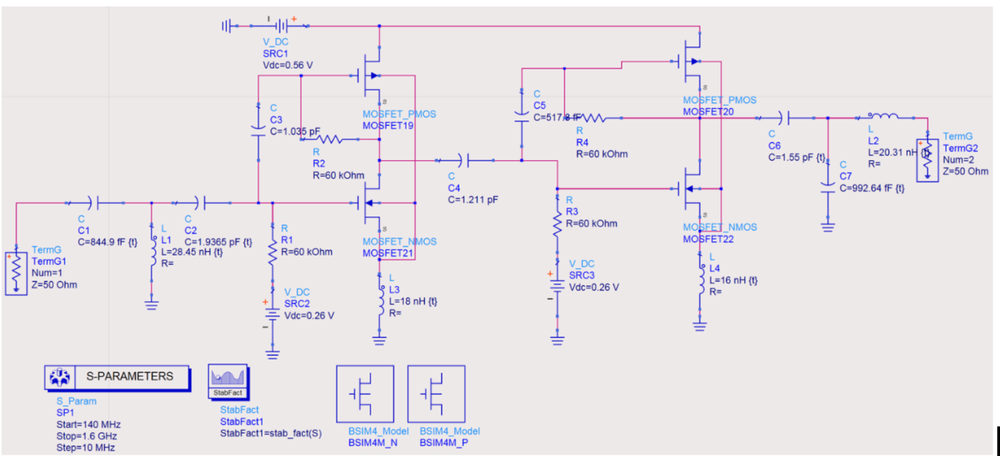
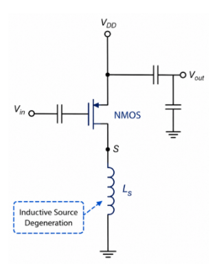
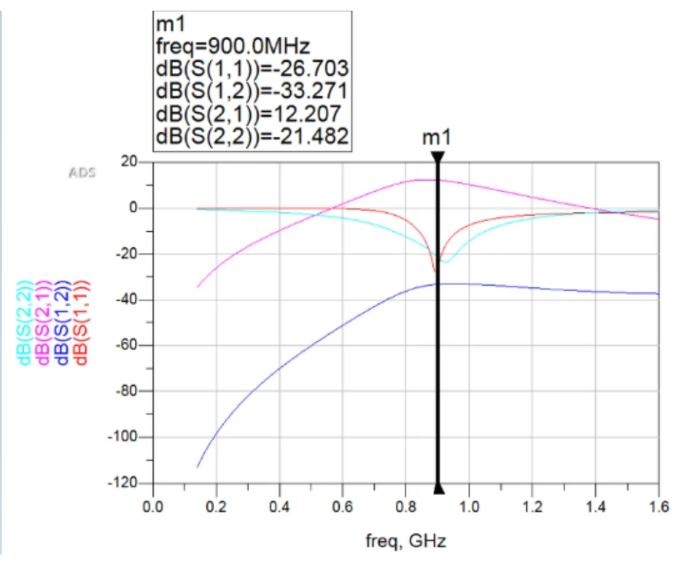
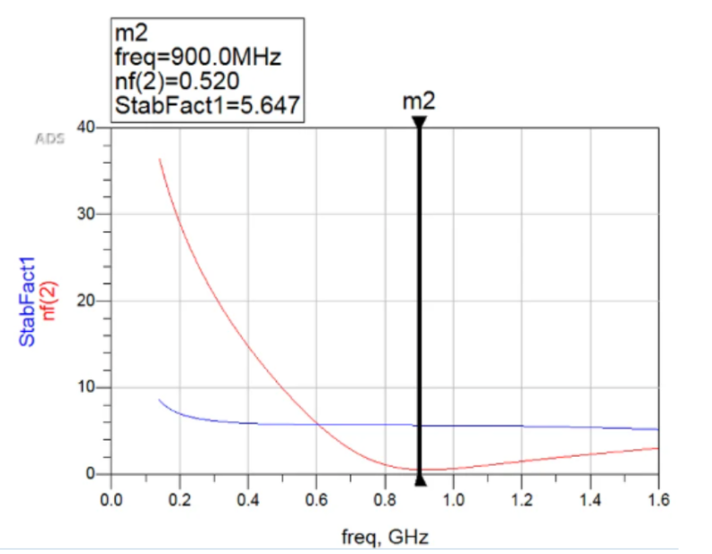
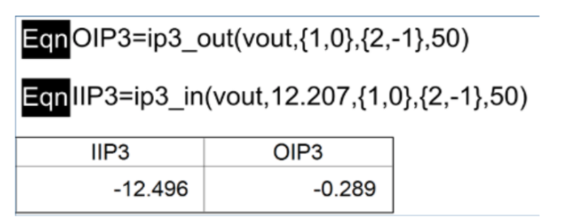
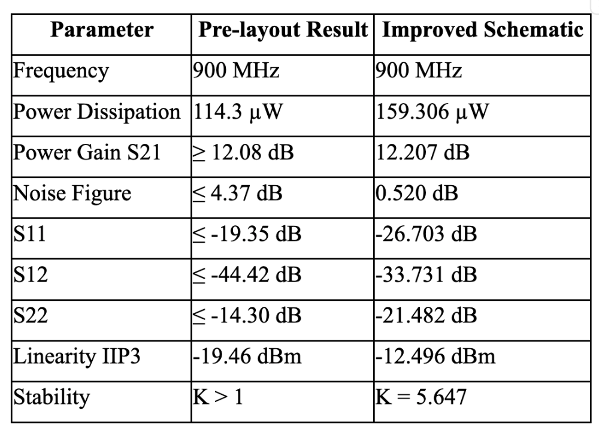

# 📡 Ultra-Low-Power 900 MHz IF LNA Design and Optimization

## 📖 Overview

This project presents the design and optimization of an **Ultra-Low-Power 900 MHz Intermediate Frequency (IF) Low Noise Amplifier (LNA)** for low-power RF receiver applications.

The design was developed and simulated using **Keysight ADS (Advanced Design System)** and optimized through:

- ⚡ Bias Current Optimization
- 📶 Inductive Source Degeneration (ISD)
- 🎯 Impedance Matching
- 🔇 Noise Figure Reduction
- 📈 Linearity Enhancement

---

## 🎯 Project Objectives

- Design a low-power IF LNA operating at **900 MHz**
- Reduce power consumption while maintaining gain
- Improve noise performance
- Enhance circuit stability
- Improve linearity performance
- Compare optimized design against a reference architecture

---

## 🏗️ Design Flow

### 📌 Reference Circuit

The project began with a reference low-power IF LNA architecture obtained from published literature.

<p align="center">
  
</p>

---

### 🔧 Optimized Circuit Design

The circuit was improved through bias optimization and matching network refinement.

<p align="center">
  
</p>

---

### 📶 Inductive Source Degeneration

Inductive Source Degeneration (ISD) was implemented to improve:

- Input matching
- Stability
- Noise performance
- Gain optimization

<p align="center">
  
</p>

---

## 📊 Simulation Results

### 📈 S-Parameter Analysis

<p align="center">
  
</p>

Key observations:

- Improved gain performance

- Better impedance matching

- Stable operation near 900 MHz

---

### 🔇 Noise Figure & Stability Analysis

<p align="center">
  
</p>

Results indicate:

- Lower noise contribution

- Stable operation across the target frequency range

---

### 📡 IIP3 Analysis

<p align="center">
  
</p>

The optimized design demonstrates improved linearity compared with the reference circuit.

---

### 🏆 Performance Comparison

<p align="center">
  
</p>

Performance metrics compared:

| Parameter | Reference Design | Optimized Design |
|------------|------------|------------|
| Gain | Improved | ✅ |
| Noise Figure | Reduced | ✅ |
| Stability | Enhanced | ✅ |
| Power Consumption | Lower | ✅ |
| Linearity (IIP3) | Improved | ✅ |

---

## 🖥️ ADS Simulation Files

The complete ADS project files are available separately.

📂 See:

```text
simulation/ADS_simulation_files.txt
```

for simulation resources and project access information.

---

## 📚 Documentation

Project reports and supporting materials:

- 📄 [Final Report](docs/Final_Report.pdf)
- 📄 [Design Theory](docs/Design_Theory.pdf)
- 📄 [Project Presentation](docs/Project_Presentation.pdf)

All documents are available in the `docs/` directory.

---

## 🛠️ Software & Tools

- 🔹 Keysight ADS
- 🔹 RF Circuit Design
- 🔹 Small-Signal Analysis
- 🔹 Noise Figure Analysis
- 🔹 S-Parameter Analysis
- 🔹 Linearity Evaluation (IIP3)

---

## 👥 Project Team

This project was developed as part of a group assignment in the Telecommunications Engineering course.

Team Members:
- Anindya Putri Defana
- Annisa Sheryl Tabina
- Drina Shahada Wibowo

---

## 🔑 Keywords

`Low Noise Amplifier`

`900 MHz`

`RF Receiver`

`IF Amplifier`

`Inductive Source Degeneration`

`Bias Optimization`

`ADS`

`Low-Power RF Design`
